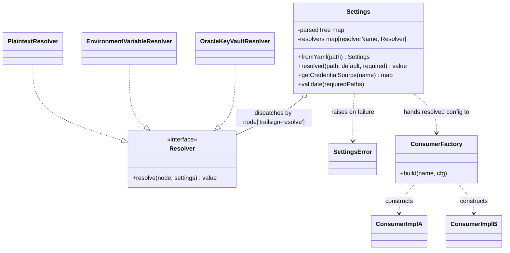
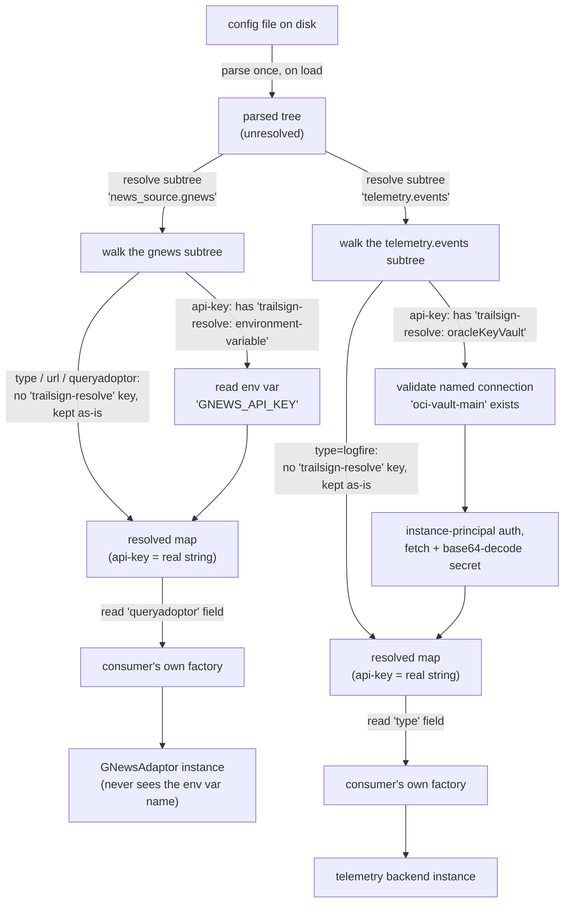

# Trailsign: architecture

**This document describes the design independent of any implementation
language** — the config shape, the resolve/dispatch logic, and the class
relationships below hold equally whether this gets built in Python, Go,
or Rust: an "interface" here is a Go `interface`, a Rust `trait`, or a
Python `typing.Protocol` depending who's building it — same contract
either way. [`settings.py`](../src/trailsign/settings.py) is the Python
reference implementation, linked wherever the prose below has a concrete
counterpart in it, but nothing in this doc should require reading that
file to be understood.

*Design rationale, decision history, and open questions live in a
private internal repo — this doc covers what a consumer of the library
needs: the config shape, the resolver reference, and how a value flows
from config to plain data.*

## The config shape

**One config file, nested by subsystem, is the single source of truth.**
Plain config values (`url`, `model`, `frequency`, `type`) are bare
scalars. Only values whose *source* might legitimately vary — API keys,
tokens, anything secret — are wrapped in a small typed-value object that
declares where to actually get the value from:

```yaml
trailsign-credential-sources:
  oci-vault-main:
    type: oracleKeyVault
    region: us-ashburn-1
    vault_ocid: ocid1.vault.oc1....
    compartment_ocid: ocid1.compartment.oc1....

models:
  guardrail:
    api-key:
      trailsign-resolve: oracleKeyVault
      source: oci-vault-main       # references the named connection above
      secret_ocid: ocid1.vaultsecret.oc1....
      name: guardrail-deepseek-key # label only, for logs/errors
    url: https://api.deepseek.com
    model: deepseek-v4-flash
  main:
    api-key:
      trailsign-resolve: plaintext
      value: sk-xxxx
    url: https://api.deepseek.com
    model: deepseek-v4-flash

news_source:
  bbc:
    type: rss
    url: https://feeds.bbci.co.uk/news/technology/rss.xml
    queryadoptor: RssAdaptor
  gnews:
    type: api
    url: https://gnews.io/api/v4/search
    api-key:
      trailsign-resolve: environment-variable
      name: GNEWS_API_KEY
    queryadoptor: GNewsAdaptor
```

`trailsign-resolve:` and `trailsign-credential-sources:` are both
reserved, namespaced keys — deliberately not bare words like `resolve`
or `credential_sources` — so neither can ever collide with a consuming
project's own field names. Note that
`trailsign-credential-sources.oci-vault-main.type: oracleKeyVault` above
keeps a plain `type:` — that block is a connection definition, never
passed through resolution; only the presence of the `trailsign-resolve`
key itself triggers dispatch, never a subsystem's own `type:` field.

**`trailsign-credential-sources:`** holds reusable, named *connection*-level
definitions (region, vault/compartment id, auth shape) — written once,
referenced by `source:` from any key that needs that vault. A key's own
typed-value block only carries what's specific to that one secret
(`secret_ocid`, a human-readable `name`), not the connection details
again. Adding a second credential-source type (e.g. AWS Secrets Manager)
is just another named block under `trailsign-credential-sources:` plus a new
Resolver implementation, not a redesign.

**Note on `oracleKeyVault` today**: under instance-principal auth (the
only auth shape currently implemented), `region`/`vault_ocid`/
`compartment_ocid` are *not* load-bearing for `OracleKeyVaultResolver` —
`get_secret_bundle(secret_ocid)` needs only the secret's own OCID plus
an authenticated client, nothing else from `trailsign-credential-sources`.
The `source:` reference is still validated to exist, and is where a
future auth shape needing that connection info would read it from —
those fields are documentation for humans today, not consumed by the
resolve step.

## Two jobs, two owners — the load-bearing decision

1. **Resolving a marked value to a plain string** — `Settings`' job, and
   *only* Settings' job. Walks the config tree; wherever a node carries
   the reserved `trailsign-resolve:` key, dispatches to the resolver
   registered under that value and replaces the whole node with its
   output. Doesn't care what subsystem the value came from — same
   mechanism either way.
2. **Turning a resolved config block into a live object** (an
   `RssAdaptor`, a `GNewsAdaptor`, a `TelegramTarget`, a chat model
   instance) — **not Trailsign's job.** Each consuming subsystem owns a
   small factory (a plain name→constructor map) that looks up its own
   discriminator field (`queryadoptor`, `type`, whatever the consumer
   calls it) in its own registry, and constructs the instance from the
   *already-resolved* plain values Trailsign handed it. The instance
   itself never sees a `{trailsign-resolve: environment-variable, ...}`
   node, only the final string.

Why split it this way rather than one class doing both: value resolution
is generic and reusable across any subsystem of any consuming project;
object construction is subsystem-specific (an `RssAdaptor` and a
`TelegramTarget` don't share a base class or a constructor shape).
Folding construction into `Settings` would mean `Settings` importing
every consumer's own classes — real coupling, and the opposite of what a
portable settings library should look like.

**The contract, stated independent of any language**: calling *resolve
this subtree* on `news_source.gnews` returns a flat map —

```
{type: api, url: "https://gnews.io/api/v4/search",
 api-key: "<the real key, already resolved>",
 queryadoptor: GNewsAdaptor}
```

— with no `{trailsign-resolve: environment-variable, ...}` node
surviving anywhere inside it; that shape is consumed during resolution,
never handed onward. A consumer's own factory (a plain name→constructor
map) looks up its discriminator field in that map and builds the
instance from the already-resolved values. See
[`settings.py`](../src/trailsign/settings.py)'s `Settings.resolved()` for the Python
reference implementation of the resolve step.

## Resolvers are pluggable — one interface, one implementation per source type

The **Resolver interface** has exactly one method: *given a typed-value
node and a way to look up other settings (for cross-references like
`trailsign-credential-sources`), return the resolved value.* In Python this is a
`typing.Protocol`; in Go it'd be a one-method `interface`; in Rust a
`trait` with one required method. Adding a new source (AWS Secrets
Manager, Azure Key Vault, ...) means writing one new implementation of
this interface and registering it under a name — never a change to the
core resolve/dispatch logic itself.

v1 ships three implementations, selected via the node's
`trailsign-resolve:` field:

| `trailsign-resolve:` value | Resolves by |
|---|---|
| `plaintext` | Reading the node's own `value` field directly — no lookup at all |
| `environment-variable` | Reading the node's `name` field, then reading that name from the process environment |
| `oracleKeyVault` | Validating the node's `source` field names a real entry in the top-level `trailsign-credential-sources` block, then fetching the node's own `secret_ocid` from OCI's Secrets service via instance-principal auth and base64-decoding the result to a plain string |

`oracleKeyVault`'s implementation is the **only** place in this
design that touches a cloud vendor's SDK, and that dependency is
loaded lazily (only when a value of that type is actually resolved, not
at program start) — a consumer with no Oracle dependency never needs
that SDK present at all, in any language. See
[`settings.py`](../src/trailsign/settings.py)'s `OracleKeyVaultResolver` for how the
Python reference implementation does this (a local `import oci` inside
the method body, not a module-level import). It only works from inside
an OCI compute instance today (instance-principal auth has no static
credential) — see `tools/verify_oracle_vault.py` for a live-secret
verification script.

## How the data actually flows: config → resolved value → consumer

Code: [`settings.py`](../src/trailsign/settings.py) — a reference
implementation, packaged and tested (see `../tests/`). What follows
describes what that code does, without reading the code itself.

### Walkthrough 1 — a news source's API key (`news_source.gnews`)

1. **Load**: `Settings.from_yaml(path)` reads the whole config file once
   into a plain nested dict — no resolution happens yet, this step is
   just parsing.
2. **A caller asks for one subtree**: `settings.resolved("news_source.gnews")`
   walks the dotted path down to that node.
3. **The resolver walks that node's children recursively.** Most of
   `news_source.gnews` (`type: api`, `url: ...`, `queryadoptor:
   GNewsAdaptor`) is left untouched — none of those carry
   `trailsign-resolve`.
4. **One child *is* resolver-shaped**: `api-key: {trailsign-resolve:
   environment-variable, name: GNEWS_API_KEY}`. The presence of
   `trailsign-resolve:` marks it for dispatch, so that whole node gets
   replaced by calling that resolver's one method, which reads the
   environment variable named `GNEWS_API_KEY` and returns the real key
   as a plain string.
5. **The caller gets back one flat, ready-to-use dict** — `{"type":
   "api", "url": "...", "api-key": "<the real key>", "queryadoptor":
   "GNewsAdaptor"}`. No `{trailsign-resolve: environment-variable, ...}`
   node survives in the output; that shape only ever exists inside the
   config's raw tree.
6. **The consumer's own factory** looks up `cfg["queryadoptor"]`
   (`"GNewsAdaptor"`) in its registry and constructs the adaptor, passing
   it this already-resolved dict. The adaptor instance itself never sees
   the word "environment-variable" — only the final string.

### Walkthrough 2 — a telemetry backend's credential (`telemetry.events`)

Same mechanism, different subsystem, and this time the value comes from
a vault instead of an env var — showing why steps 3/4 above don't care
which resolver ends up firing:

```yaml
telemetry:
  events:
    type: logfire
    api-key:
      trailsign-resolve: oracleKeyVault
      source: oci-vault-main
      secret_ocid: ocid1.vaultsecret.oc1....
```

1. `settings.resolved("telemetry.events")` walks this node the same way.
2. `type: logfire` has no `trailsign-resolve:` key → left alone, becomes
   part of the output dict as-is (it's the consumer's own discriminator,
   see step 5).
3. `api-key` **has** a `trailsign-resolve:` key (`oracleKeyVault`) →
   `OracleKeyVaultResolver.resolve(...)` runs. It validates that
   `settings.get_credential_source("oci-vault-main")` names a real entry
   under top-level `trailsign-credential-sources:`, then authenticates via
   instance-principal auth and calls the OCI Secrets SDK with this
   node's own `secret_ocid` to fetch and base64-decode the real key —
   the connection block's own fields aren't used by this auth shape (see
   the note under "The config shape" above).
4. Output: `{"type": "logfire", "api-key": "<the real key>"}`.
5. The consumer's own factory reads `cfg["type"]` (`"logfire"`) and
   constructs whatever backend implementation is registered under that
   name, with the resolved key. If `telemetry.events.type` were
   something else, the same factory would construct a different
   implementation instead — the design doesn't care, as long as the
   consumer's own registry does.

### Class/data relationships



`ConsumerFactory`/`ConsumerImplA`/`ConsumerImplB` are a stand-in — every
consuming project has its own (a news-source registry, a delivery-target
registry, a telemetry-backend registry, ...). Shown here to make the
boundary concrete: `Settings` and its resolvers stop existing the moment
a consumer's factory takes over. `Settings` never imports or knows about
any consumer's own classes; the arrow into the factory is "hands
resolved data to," not an import dependency.

### Runtime sequence for both walkthroughs above



**Not designed yet, deliberately**: type-coercion helpers (`get_int`/
`get_bool`, likely thin wrappers around `resolved()` — add when a real
call site needs one); anything about *writing* settings back (this is
read-only by design — a consumer's own runtime per-user/per-session
data is out of scope entirely).
