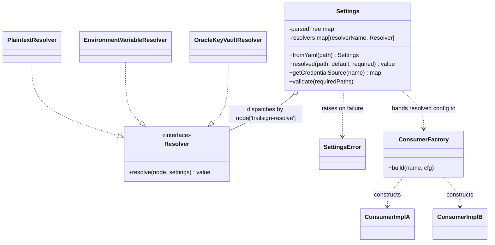
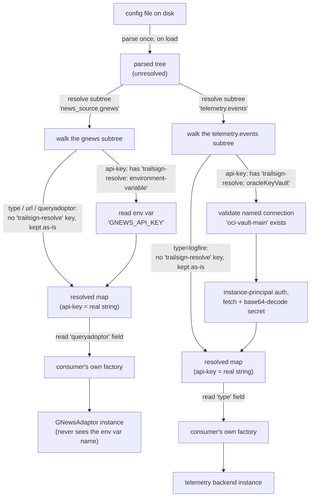

# Trailsign: design

**Status: design converged 2026-08-31, extracted into its own project
2026-09-01.** Living document — edited in place as decisions land, not
re-created.

**This document describes the design independent of any implementation
language** — the config shape, the resolve/dispatch logic, and the class
relationships below hold equally whether this gets built in Python, Go,
or Rust: an "interface" here is a Go `interface`, a Rust `trait`, or a
Python `typing.Protocol` depending who's building it — same contract
either way. [`settings.py`](../src/trailsign/settings.py) is one reference
implementation (Python), linked wherever the prose below has a concrete
counterpart in it, but nothing in this doc should require reading that
file to be understood.

## Origin: the environment this design was extracted from

This design started life inside a Telegram news-trend bot (then named
Argus, now Auguring) while building a settings abstraction so that bot
could run standalone as well as on its current cloud deployment. The
table below — every raw environment-variable read that bot's code had,
as of 2026-08-31, found by grep — isn't Trailsign's own scope; it's kept
here because it's *why* the design has the shape it has (nested by
subsystem, a `credential_sources:` block for vault-backed secrets, a
`plaintext`/`environment-variable`/`oracleKeyVault` resolver set as the
starting three).

| Variable | Secret? |
|---|---|
| `TELEGRAM_BOT_TOKEN`, `ADMIN_BOT_TOKEN` | yes |
| `ADMIN_CHAT_ID` | no |
| `DEEPSEEK_API_KEY` | yes |
| `LLM_MODEL` / `LLM_MODEL_CLASSIFIER` | no |
| `LOGFIRE_API_KEY` | yes |
| `NEWSAPI_API_KEY`, `GNEWS_API_KEY`, `PERIGON_API_KEY` | yes |
| `NEWS_CACHE_DIR`, `MESSAGE_ARCHIVE_DIR`, `SUBSCRIBERS_DB_FILE` | no |

Every one of these was its own raw environment read, in its own file,
with its own ad hoc default — no single place listed "every setting this
bot understands." That's the actual problem this design solves, stated
generically: a project with more than a handful of settings needs one
place that lists them all, with each one's real source made explicit
rather than assumed.

## The converged design

**One config file, nested by subsystem, is the single source of truth.**
Plain config values (`url`, `model`, `frequency`, `type`) are bare
scalars. Only values whose *source* might legitimately vary — API keys,
tokens, anything secret — are wrapped in a small typed-value object that
declares where to actually get the value from:

```yaml
credential_sources:
  oci-vault-main:
    type: oracleKeyVault
    region: us-ashburn-1
    vault_ocid: ocid1.vault.oc1....
    compartment_ocid: ocid1.compartment.oc1....

models:
  guardrail:
    api-key:
      trailsign-resolve: oracleKeyVault
      source: oci-vault-main       # references the named connection above
      secret_ocid: ocid1.vaultsecret.oc1....
      name: guardrail-deepseek-key # label only, for logs/errors
    url: https://api.deepseek.com
    model: deepseek-v4-flash
  main:
    api-key:
      trailsign-resolve: plaintext
      value: sk-xxxx
    url: https://api.deepseek.com
    model: deepseek-v4-flash

news_source:
  bbc:
    type: rss
    url: https://feeds.bbci.co.uk/news/technology/rss.xml
    queryadoptor: RssAdaptor
  gnews:
    type: api
    url: https://gnews.io/api/v4/search
    api-key:
      trailsign-resolve: environment-variable
      name: GNEWS_API_KEY
    queryadoptor: GNewsAdaptor
```

Note `credential_sources.oci-vault-main.type: oracleKeyVault` above keeps
plain `type:` — that block is a connection definition, never passed
through resolution (see "Fixing an ambiguity" below for why that
distinction has to be structural, not coincidental).

**`credential_sources:`** holds reusable, named *connection*-level
definitions (region, vault/compartment id, auth shape) — written once,
referenced by `source:` from any key that needs that vault. A key's own
typed-value block only carries what's specific to that one secret
(`secret_ocid`, a human-readable `name`), not the connection details
again. Adding a second credential-source type (e.g. AWS Secrets Manager)
is just another named block under `credential_sources:` plus a new
Resolver implementation, not a redesign.

**Correction, verified 2026-09-01 against a live OCI Vault secret**:
under instance-principal auth (the only auth shape this design actually
implements — see "Resolved questions" below), `region`/`vault_ocid`/
`compartment_ocid` are *not* load-bearing for `OracleKeyVaultResolver` —
`get_secret_bundle(secret_ocid)` needs only the secret's own OCID plus
an authenticated client, nothing from `credential_sources` itself. The
`source:` reference is still real (it's validated to exist, and is
where a future auth shape needing that connection info would read it
from), but today those fields are effectively documentation for humans,
not consumed by the resolve step. Left in the example above since a
`source:` block naming *some* vault is still how a reader knows which
vault a secret lives in, and a future non-instance-principal resolver
variant may need them for real.

### Two jobs, two owners — this is the load-bearing decision

1. **Resolving a marked value to a plain string** — `Settings`' job, and
   *only* Settings' job. Walks the config tree; wherever a node carries
   the reserved `trailsign-resolve:` key, dispatches to the resolver
   registered under that value and replaces the whole node with its
   output. Doesn't care what subsystem the value came from — same
   mechanism either way.
2. **Turning a resolved config block into a live object** (an
   `RssAdaptor`, a `GNewsAdaptor`, a `TelegramTarget`, a chat model
   instance) — **not Trailsign's job.** Each consuming subsystem owns a
   small factory (a plain name→constructor map) that looks up its own
   discriminator field (`queryadoptor`, `type`, whatever the consumer
   calls it) in its own registry, and constructs the instance from the
   *already-resolved* plain values Trailsign handed it. The instance
   itself never sees a `{trailsign-resolve: environment-variable, ...}`
   node, only the final string.

Why split it this way rather than one class doing both: value resolution
is generic and reusable across any subsystem of any consuming project;
object construction is subsystem-specific (an `RssAdaptor` and a
`TelegramTarget` don't share a base class or a constructor shape).
Folding construction into `Settings` would mean `Settings` importing
every consumer's own classes — real coupling, and the opposite of what a
portable settings library should look like. It also keeps "which class
implements this" grep-able in each consumer's own registry, instead of
resolved via a generic dynamic-import-by-string mechanism that's harder
to trace when it points at the wrong thing.

**The contract, stated independent of any language**: calling *resolve
this subtree* on `news_source.gnews` returns a flat map —

```
{type: api, url: "https://gnews.io/api/v4/search",
 api-key: "<the real key, already resolved>",
 queryadoptor: GNewsAdaptor}
```

— with no `{trailsign-resolve: environment-variable, ...}` node
surviving anywhere inside it; that shape is consumed during resolution,
never handed onward. A consumer's own factory (a plain name→constructor
map) looks up its discriminator field in that map and builds the
instance from the already-resolved values. See
[`settings.py`](../src/trailsign/settings.py)'s `Settings.resolved()` for the Python
reference implementation of the resolve step.

### Resolvers are pluggable — one interface, one implementation per source type

The **Resolver interface** has exactly one method: *given a typed-value
node and a way to look up other settings (for cross-references like
`credential_sources`), return the resolved value.* In Python this is a
`typing.Protocol`; in Go it'd be a one-method `interface`; in Rust a
`trait` with one required method. Whatever the language, adding a new
source (AWS Secrets Manager, Azure Key Vault, ...) means writing one new
implementation of this interface and registering it under a name —
never a change to the core resolve/dispatch logic itself.

v1 ships three implementations, selected via the node's
`trailsign-resolve:` field (see "Fixing an ambiguity" below for why
that's a dedicated, namespaced key rather than a bare word like
`resolve`, let alone a subsystem's own `type:` field):

| `trailsign-resolve:` value | Resolves by |
|---|---|
| `plaintext` | Reading the node's own `value` field directly — no lookup at all |
| `environment-variable` | Reading the node's `name` field, then reading that name from the process environment |
| `oracleKeyVault` | Validating the node's `source` field names a real entry in the top-level `credential_sources` block, then fetching the node's own `secret_ocid` from OCI's Secrets service via instance-principal auth and base64-decoding the result to a plain string |

`oracleKeyVault`'s implementation should be the **only** place in this
design that touches a cloud vendor's SDK, and that dependency should be
loaded lazily (only when a value of that type is actually resolved, not
at program start) — a consumer with no Oracle dependency never needs
that SDK present at all, in any language. See
[`settings.py`](../src/trailsign/settings.py)'s `OracleKeyVaultResolver` for how the
Python reference implementation does this (a local `import oci` inside
the method body, not a module-level import).

## How the data actually flows: config → resolved value → consumer

Code: [`settings.py`](../src/trailsign/settings.py) — a reference
implementation, packaged and tested (see `../tests/`). What follows
describes what that code does, without reading the code itself.

### Fixing an ambiguity: a bare `resolve` word wasn't enough either

**Two rounds of the same underlying problem, both fixed before this
became its own project.** Round one: the original design reused a
subsystem's own `type:` field as the resolver-dispatch signal too —
`news_source.gnews.type: api` (a subsystem discriminator) collided with
`api-key.type: environment-variable` (a resolve directive), and broke
outright on `credential_sources.oci-vault-main.type: oracleKeyVault`
(a connection definition whose `type` happens to equal a real resolver
name — not a rare coincidence, since a credential source's own type and
a resolver's name describe the same underlying service by construction).
Round two: a dedicated `resolve:` key fixed the `type:` collision, but a
bare English word is still a *generic* one — nothing stops some
consumer's own schema from legitimately needing a field literally named
`resolve` for an unrelated reason. **Fix: `trailsign-resolve:`, namespaced
to this project specifically** — a key this unlikely to ever appear as
someone else's real field name isn't a coincidence risk at all. Plain
`type:` (or any other field) stays completely free for consumers to use
however they want.

`_resolve_node`'s rule is purely structural: a dict is resolvable iff it
carries the `trailsign-resolve` key — no dependency on what resolvers
happen to be registered, no dependency on what any other field is named.
A `trailsign-resolve` value naming an unregistered resolver raises
`SettingsError` rather than silently passing the node through unresolved
— once a node declares intent to be resolved, an unrecognized target
should never resolve to itself unresolved.

### Walkthrough 1 — a news source's API key (`news_source.gnews`)

1. **Load**: `Settings.from_yaml(path)` reads the whole config file once
   into a plain nested dict — no resolution happens yet, this step is
   just parsing.
2. **A caller asks for one subtree**: `settings.resolved("news_source.gnews")`
   walks the dotted path down to that node.
3. **The resolver walks that node's children recursively.** Most of
   `news_source.gnews` (`type: api`, `url: ...`, `queryadoptor:
   GNewsAdaptor`) is left untouched — none of those carry
   `trailsign-resolve`.
4. **One child *is* resolver-shaped**: `api-key: {trailsign-resolve:
   environment-variable, name: GNEWS_API_KEY}`. The presence of
   `trailsign-resolve:` marks it for dispatch, so that whole node gets
   replaced by calling that resolver's one method, which reads the
   environment variable named `GNEWS_API_KEY` and returns the real key
   as a plain string.
5. **The caller gets back one flat, ready-to-use dict** — `{"type":
   "api", "url": "...", "api-key": "<the real key>", "queryadoptor":
   "GNewsAdaptor"}`. No `{trailsign-resolve: environment-variable, ...}`
   node survives in the output; that shape only ever exists inside the
   config's raw tree.
6. **The consumer's own factory** looks up `cfg["queryadoptor"]`
   (`"GNewsAdaptor"`) in its registry and constructs the adaptor, passing
   it this already-resolved dict. The adaptor instance itself never sees
   the word "environment-variable" — only the final string.

### Walkthrough 2 — a telemetry backend's credential (`telemetry.events`)

Same mechanism, different subsystem, and this time the value comes from
a vault instead of an env var — showing why steps 3/4 above don't care
which resolver ends up firing:

```yaml
telemetry:
  events:
    type: logfire
    api-key:
      trailsign-resolve: oracleKeyVault
      source: oci-vault-main
      secret_ocid: ocid1.vaultsecret.oc1....
```

1. `settings.resolved("telemetry.events")` walks this node the same way.
2. `type: logfire` has no `trailsign-resolve:` key → left alone, becomes
   part of the output dict as-is (it's the consumer's own discriminator,
   see step 5).
3. `api-key` **has** a `trailsign-resolve:` key (`oracleKeyVault`) →
   `OracleKeyVaultResolver.resolve(...)` runs. It validates that
   `settings.get_credential_source("oci-vault-main")` names a real entry
   under top-level `credential_sources:`, then authenticates via
   instance-principal auth and calls the OCI Secrets SDK with this
   node's own `secret_ocid` to fetch and base64-decode the real key —
   the connection block's own fields aren't used by this auth shape (see
   the correction note under "The converged design" above).
4. Output: `{"type": "logfire", "api-key": "<the real key>"}`.
5. The consumer's own factory reads `cfg["type"]` (`"logfire"`) and
   constructs whatever backend implementation is registered under that
   name, with the resolved key. If `telemetry.events.type` were
   something else, the same factory would construct a different
   implementation instead — the design doesn't care, as long as the
   consumer's own registry does.

### Class/data relationships



`ConsumerFactory`/`ConsumerImplA`/`ConsumerImplB` are a stand-in — every
consuming project has its own (a news-source registry, a delivery-target
registry, a telemetry-backend registry, ...). Shown here to make the
boundary concrete: `Settings` and its resolvers stop existing the moment
a consumer's factory takes over. `Settings` never imports or knows about
any consumer's own classes; the arrow into the factory is "hands
resolved data to," not an import dependency.

### Runtime sequence for both walkthroughs above



**Not designed yet, deliberately**: type-coercion helpers (`get_int`/
`get_bool`, likely thin wrappers around `resolved()` — add when a real
call site needs one); anything about *writing* settings back (this is
read-only by design — a consumer's own runtime per-user/per-session
data is out of scope entirely).

## Resolved questions

1. **Precedence** — moot as originally framed. There's no global "env
   var vs. config file, who wins" — every value declares its own source
   explicitly, at that value. (An `environment-variable` node still
   reads from the process environment, same as before — it's just
   declared, not implicit.)
2. **Flat vs. nested keys** — nested, by subsystem (`models.guardrail`,
   `news_source.gnews`, ...), confirmed by the examples above.
3. **What "KV"/vault support means** — resolved as one Resolver
   implementation among several, selected per-value by that value's own
   `trailsign-resolve:` field. The vault SDK only ever gets imported
   inside that one resolver, only when a value actually asks for it.
4. **Resolver extensibility** — confirmed pluggable, via the one-method
   Resolver interface described above (language-agnostic;
   `settings.py`'s `SettingsResolver` is its Python expression).
5. **The dispatch key had to be a dedicated, namespaced word** — two
   rounds of collision (see "Fixing an ambiguity" above) before landing
   on `trailsign-resolve:`, which is unlikely enough as a real-world
   field name to treat as effectively collision-free.
6. **`credential_sources`' OCI auth-config shape** — resolved 2026-09-01:
   instance-principal auth
   (`oci.auth.signers.InstancePrincipalsSecurityTokenSigner`), matching
   the same auth shape every other secret fetch in the originating bot's
   own production deployment already uses (`oci secrets secret-bundle
   get --auth instance_principal`) — no static config file or explicit
   key, and it only works from inside an OCI compute instance. Verified
   end to end against a real vault secret via
   `tools/verify_oracle_vault.py` (requires an IAM policy granting the
   calling instance's dynamic group `read secret-bundles` — a real,
   one-time gap hit during that verification, not a code issue). As a
   consequence, `credential_sources`' `region`/`vault_ocid`/
   `compartment_ocid` fields turned out not to be load-bearing for this
   resolver (see the correction note under "The converged design" above)
   — only `secret_ocid` and an authenticated client are actually used.

## Still open

- **File format / library** — yaml assumed throughout (matches every
  example so far); parsing itself needs nothing beyond a standard yaml
  library for whatever language implements this (`PyYAML` in the Python
  reference implementation; `gopkg.in/yaml.v3` in Go, `serde_yaml` in
  Rust would be the equivalents) — no need for a heavier settings
  framework, since the resolution logic itself is bespoke either way.
- **Validation timing** — the reference implementation ships both:
  `resolved()` is lazy (per-access), `validate(required_paths)` is the
  opt-in eager path a consumer's entry point is meant to call up front.
  Still needs confirming that's actually the right default, not just a
  plausible draft.
- **A port to a second language** — the Python package (`pyproject.toml`,
  src layout, test suite) is built out; a port to at least one other
  language is still open, given the whole point of this design is being
  language-independent, not just Python.
- **A non-instance-principal OCI auth shape** — instance-principal is the
  only auth shape implemented (see "Resolved questions" above); a
  consumer running `oracleKeyVault` outside an OCI compute instance
  (local dev, CI) isn't supported yet. Same question will come up again
  for every other vault-style resolver added later (AWS Secrets Manager,
  Azure Key Vault, ...) — each will need its own real auth shape pinned
  down against that vendor's actual production usage, not guessed.
- **How a consuming project should sequence its own migration onto
  this** — not a Trailsign design question exactly, but worth a note in
  this library's own docs eventually: migrate one subsystem at a time,
  behavior unchanged at each step, rather than one large cutover.
